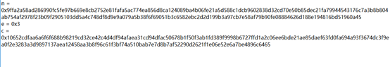

# Cryptography

---

## Hexahedron
Difficulty: Easy

Description:  
So much of crypto is all about shapes! Since some shapes have so many special sides :)  

Cipher is [here](Hexahedron/hexahedron.txt).

### Solution
* RSA
* e=3
* RSA small exponent

We can cube root the cipher and get the message.  
The script is attached [here](Hexahedron/Hexahedron.py).
