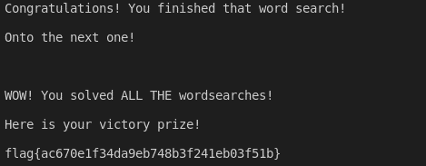
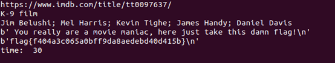

# Scripting
---

## Words Church
Difficulty: Medium

Description:  
Tired of finding bugs and exploiting vulnerabilities? Want a classic brain buster instead? Why not play a wordsearch -- in fact, why not play thirty word searches!!

### Solution
The basic idea is writing a secript to answer the question automatically.
You can find script [here](Words_Chruch/words.py).

**flag{ac670e1f34da9eb748b3f241eb03f51b}**

---

## OPT Smasher
Difficulity: Medium

Description:  
Your fingers too slow to smash, tbh.

### Solution
The script is written by python3.
* using [pytesseract](https://github.com/madmaze/pytesseract) as orc to recognize numbers in the image
* using requests to get url and post data  

You can find script [here](OPT_Smasher/orc_image.py).

**flag{f994cd9c756675b743b10c44b32e36b6}**

---

## Movie Marathon
Difficulty: Hard

Description:  
Heard some bozo bragging about knowing more movies than anyone else? Could you put him in his place, please!

Question:  
This challenge ask you to replay 5 cast members of a movie he asked.

### Solution
* using module [wikipedia](https://github.com/goldsmith/Wikipedia) to access the infomation on the wikipedia
* using pwn.remote to communicate with server
* crawl cast members of a movie both on IMDB and wikipedia
* find the same actor

You can find script [here](Movie_Marathon/actors.py).

**flag{f404a3c065a0bff9da8aedebd40d415b}**