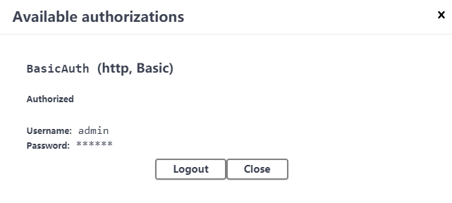
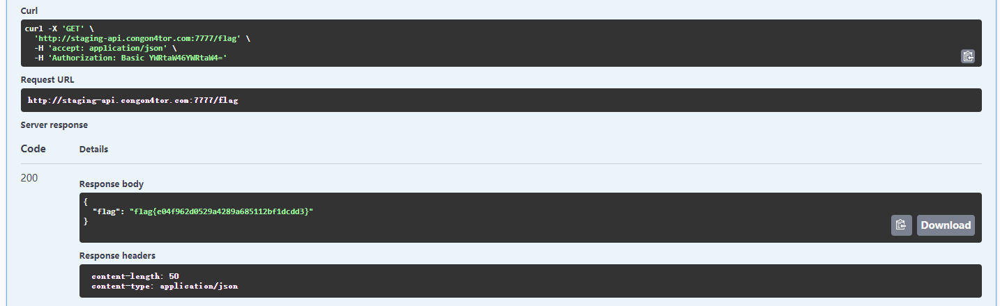
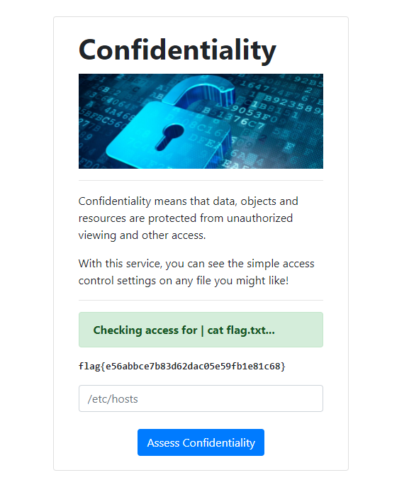
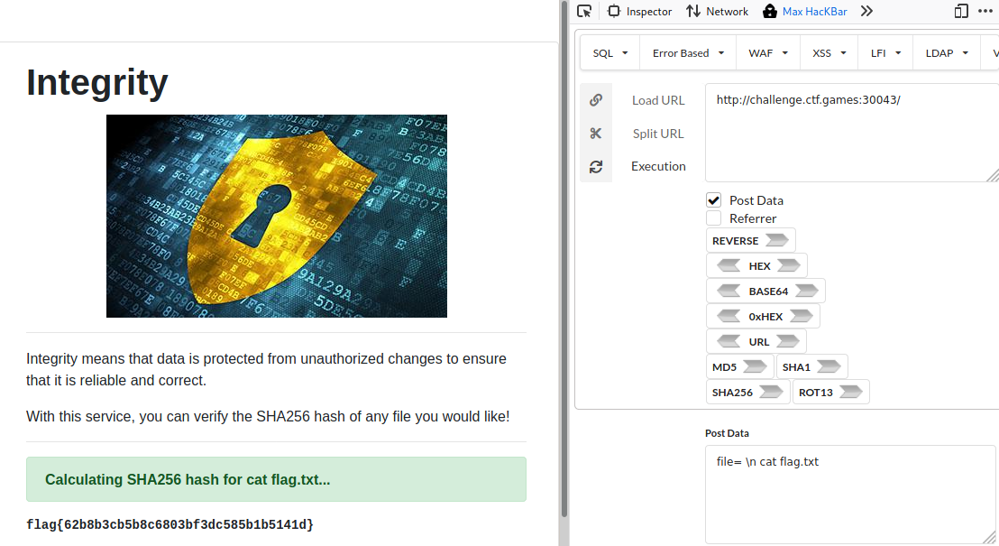
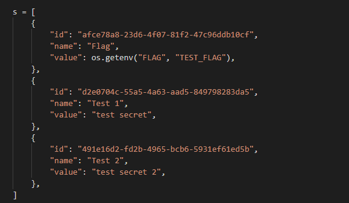
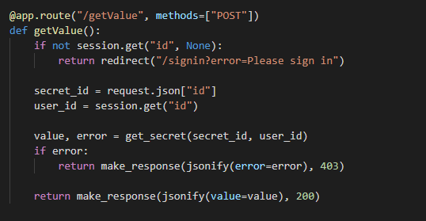
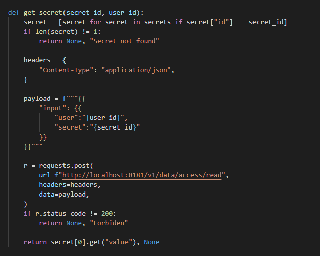
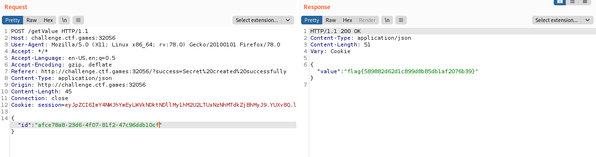

# Web

## Swaggy
Category: Web
Difficulty: Easy

Description:  
This API documentation has all the swag

### Solve

There is a weak password here, `admin, admin`

After log in, we test the api and get the flag.

flag{e04f962d0529a4289a685112bf1dcdd3}

---

## Confidentiality
Category: Web
Difficulty: Easy

Description:  
My school was trying to teach people about the CIA triad so they made all these dumb example applications... as if they know anything about information security. Can you prove these aren't so secure?

### Solution

It is a command injection.

---

## Integrity
Category: Web
Difficulty: Medium

Description:  
My school was trying to teach people about the CIA triad so they made all these dumb example applications... as if they know anything about information security.

Supposedly they learned their lesson and tried to make this one more secure. Can you prove it is still vulnerable?

### Solution

Command injection
bypass filiter `\n` 

command injection cheating sheet: https://hackersonlineclub.com/command-injection-cheatsheet/

---

## OPA Secrets
Category: Web
Difficulty: Hard

Description:  
OPA! Check out our new secret management service

### Solution
This is a code audit challenge.
After we look around the website, we find source code of the website.

The flag is hidden in the secret. We may use the secret id to get the flag.

The getValue function will return the value of secrete.

The get secret function will return value without check user session id.

We make up the post and change the secret id to get the flag

***flag{589882d62d1c899d8b85db1af2076b39}***
